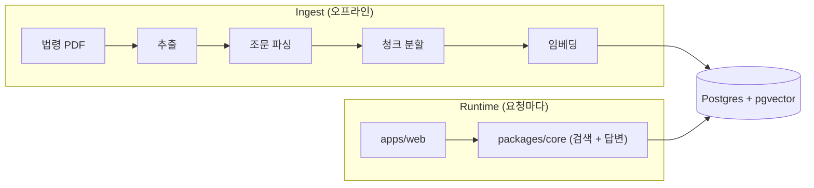

# 부가가치세 법령 상담 챗봇

부가가치세 신고 실무자를 위한 법령 상담 챗봇. 국세청 공식 법령(부가가치세법·국세기본법과 각 시행령·시행규칙)에서 근거를 찾아 답하고, 답에 붙는 인용은 모두 실제 조문과 대조해 원문의 어느 부분인지까지 짚어준다. "맞아 보이는 답"이 아니라 "근거를 추적할 수 있는 답"이 목표다.

---

## Key Features

- **법령 원문에만 근거한다** — 미리 외운 지식으로 답하지 않는다. 질문할 때마다 관련 조문을 찾아, 그 내용 안에서만 답을 만든다.
- **인용을 믿을 수 있다** — 답에 붙는 근거는 실제로 찾아온 조문에서 나온 것만 남고, 원문의 어느 부분인지까지 확인된다 (작동 방식은 [Grounding & Citation](#grounding--citation)).
- **여러 갈래로 검색한다** — 질문을 또렷하게 다듬은 다음, 질문 그대로의 검색과 임시 답에서 뽑은 키워드 검색을 함께 돌려 관련 조문을 폭넓게 모은다.
- **기록하고 채점한다** — 오가는 모든 요청을 기록하고 사용자 평가(👍/👎)를 모은다. 답의 정확도와 검색 품질은 별도 평가 도구로 점수를 매긴다.

---

## Quick Start

```bash
pnpm install
pnpm compose:up && pnpm db:migrate
pnpm ingest:extract && pnpm ingest:parse && pnpm ingest:chunk && pnpm ingest:embed && pnpm ingest:load
pnpm web:dev                                # → http://localhost:3000
```

env: 루트 + 각 워크스페이스 `.env.example` 참고.

---

## Architecture



두 경로가 같은 DB로 모인다 — Ingest는 법령을 미리 넣어두고, Runtime은 그걸 검색해 답한다.

모듈 경계 + API contract: [docs/architecture.md](./docs/architecture.md).

---

## Flows

### Ingestion

| #   | 단계   | 하는 일                                                                                                             |
| --- | ------ | ------------------------------------------------------------------------------------------------------------------- |
| 1   | 추출   | 법령 PDF를 글자·표로 읽어낸다. 한 번 읽으면 저장해 두고 재실행 때 다시 변환하지 않는다                              |
| 2   | 파싱   | 조문 번호(제N조·항·호)와 다른 조문을 가리키는 참조를 뽑아 정리한다                                                  |
| 3   | 분할   | 조문을 검색하기 좋은 크기로 자른다 (약 1200단어 분량, 끝부분 일부 겹침) · [docs](./docs/chunking.md)                |
| 4   | 임베딩 | 자른 조각을 의미를 담은 숫자(벡터)로 바꾼다. 같은 글은 저장해 두고 다시 부르지 않는다 · [docs](./docs/embedding.md) |
| 5   | 저장   | DB에 넣는다. 다시 넣을 땐 기존 걸 비우고 새로 (모델이 바뀌면 옛 데이터가 안 남게)                                   |

법령 PDF는 미리 `data/rag_knowledge_base/`에 넣어둔다

### Chat (`POST /api/chat`) — LangGraph v16 parallel

| #   | 단계         | 하는 일                                                                                  |
| --- | ------------ | ---------------------------------------------------------------------------------------- |
| 0   | 질문 다듬기  | 이어지는 질문을 앞 대화까지 합쳐, 혼자서도 이해되는 질문으로 고친다 (첫 질문이면 건너뜀) |
| 1a  | 직접 검색    | 다듬은 질문으로 관련 조문을 찾는다 → 상위 8개                                            |
| 1b  | 초벌 답 작성 | AI가 임시 답과 확인할 핵심 주장 목록을 만든다 (사용자에겐 안 보이고, 검색 힌트로만 쓴다) |
| 2   | 주장별 검색  | 핵심 주장마다 조문을 따로 찾는다 → 각 상위 4개                                           |
| 3   | 합치기       | 두 검색 결과를 모아 가장 관련 높은 10개만 남긴다                                         |
| 4   | 최종 답 작성 | 남은 조문만 근거로 답과 인용을 한 번에 만든다 (초벌 답은 참고만)                         |

자세한 흐름: [rag-chain](./docs/rag-chain.md). 답이 끝나면 대화·메시지를 한 번에 묶어 DB에 기록한다.

---

## Grounding & Citation

답이 인용하는 근거를, 그 자리에서 검색해 온 법령 조문에 강제로 묶는다.

1. **조문 안에서만 쓴다** — 답은 검색해 온 조문 내용에만 기대 작성하고, 그 조문이 뒷받침하지 못하는 내용은 답에서 뺀다.
2. **인용을 원문과 대조한다** — 답이 가져다 붙인 인용 문장을 실제 조문 원문과 맞춰본다(띄어쓰기·생략 차이까지 단계적으로 허용).
3. **결과에 따라 처리** — 원문에서 찾으면 그 위치를 화면에 강조하고, 문장이 조금 어긋나면 강조만 빼고 인용은 그대로 둔다. 검색되지도 않은 엉뚱한 조문을 인용하면 제거한다 — 지어낸 인용이 저장되지 않는다.

상세: [rag-chain.md §4](./docs/rag-chain.md#4-structured-output--citation-1회-emit).

---

## Data Governance

챗봇이 **검색에 쓰는 자료(법령)**와 **성능 채점에 쓰는 자료(매뉴얼·상담)**를 따로 둔다 — 채점용 자료가 검색에 섞이면 점수가 실제보다 부풀려지기 때문.

- **검색용 — 법령 원문** (`data/rag_knowledge_base/`) — 공식 법령 PDF 6종(부가가치세법·국세기본법, 각각 법률·시행령·시행규칙, 2026 시행본). 챗봇이 검색하고 인용하는 **유일한** 출처. 파일명에 법령 버전·시행일을 적어 개정 추적 단위로 쓴다.
- **채점용 — 평가 문항** (`data/golden_set.csv`) — 시험 문제 30개. 답이 정확한지, 관련 조문을 잘 찾아왔는지 양쪽을 채점한다. 각 문항의 모범답안은 국세청 매뉴얼·상담 사례(`golden_set_reference/`)를 보고 작성했는데, 이 자료는 챗봇 검색에는 넣지 않는다 — 넣으면 정답이 나온 출처를 그대로 베껴, 실력보다 점수가 높게 나오기 때문.

상세: [goldenset](./docs/goldenset.md).

---

## CLI

```bash
pnpm core:ask "수출 매출의 영세율 적용 요건은?"     # full RAG
pnpm core:retrieve "..." --json                      # retrieval only
pnpm ragas-eval:eval                                 # generation 채점
pnpm lbr-eval:eval                                   # retrieval 채점
pnpm db:studio                                       # Drizzle Studio
```

---

## Docs

- [mvp-spec](./docs/mvp-spec.md) — 기능 범위(in/out)·비기능·유스케이스
- [architecture](./docs/architecture.md) · [api](./docs/api.md) · [db-schema](./docs/db-schema.md) — 모듈 경계 / API 계약 / DB 스키마
- [chunking](./docs/chunking.md) · [embedding](./docs/embedding.md) — 적재 파이프라인
- [rag-chain](./docs/rag-chain.md) — 검색 primitive + 런타임 RAG 체인
- [goldenset](./docs/goldenset.md) · [evaluation](./docs/evaluation.md) — 평가셋 / 지표·실행
- [observability](./docs/observability.md)
