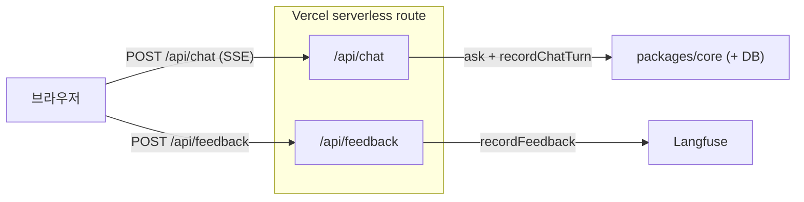

# API Contract

브라우저 → Vercel serverless route(`apps/web/app/api/*`) → core/외부. §1은 client가 보내고 받는 형태, §2는 핸들러가 호출하는 core 표면.



## 1. Client → Server (network)

### POST `/api/chat` — rate limit 적용

요청 (`apps/web/app/api/chat/route.ts`):
```jsonc
{
  "message": { /* AI SDK UIMessage, 마지막 user 메시지 한 건 */ },
  "conversationId": "uuid"
}
```

응답: AI SDK `createUIMessageStream` SSE. parts:
- `data-trace` — `{ id }` OTEL trace_id (피드백 score 송출 키)
- `data-progress` — `{ stage }` `ProgressStage`(analyzing→searching→expanding→compiling→answering). 노드 완료마다 단조 증가 emit
- `data-citation` — `Citation` 1건. generate 완료 후 verify 통과분 burst emit
- `text-start` / `text-delta` / `text-end` — 답변 본문. 1회 emit (token streaming 없음)

`withRateLimit` 3-단 sliding window: per-IP 10/min + per-IP 30/day + 전역 50/day. 초과 시 429 + `Retry-After`. (Upstash Redis env 미설정 시 graceful 통과.)

### POST `/api/feedback` — rate limit 없음

요청 (`apps/web/app/api/feedback/route.ts`):
```ts
{ traceId: string, value: 1 | -1 }
```

응답: 204. `@langfuse/client::score.create`로 trace에 score attach (이름 `user-thumbs`, dataType `NUMERIC`).

## 2. Server → Core (in-process)

```ts
// composition
createCore(config: CoreConfig): Promise<Core>
core.close(): Promise<void>

// chat (→ rag-chain.md)
core.chat.ask(query: string, opts?: {
  conversationId?: string;     // 주입 시 직전 turn 합쳐 multi-turn rewrite
  k?: number;                  // graph가 노드별 고정 k(prefilter=50, DIRECT_K=8, CLAIM_K=4) — 수신만, 효과 없음
}): Promise<{
  textStream: AsyncIterable<string>;        // 1회 emit (token streaming 없음)
  citationStream: AsyncIterable<Citation>;  // verify 통과분만, burst 후 close
  eventStream: AsyncIterable<ProgressEvent>; // 노드 완료마다 stage emit, 그래프 종료 시 end
  finish: Promise<{
    text: string;
    citations: Citation[];
    chunks: SearchResult[];                 // rerank 통과 top-k — 호출자 persist용
    inputTokens: number | undefined;        // usage_metadata 콜백 미연결
    outputTokens: number | undefined;
    finishReason: string;                   // 항상 "stop"
    model: string;
  }>;
}>

core.chat.recordChatTurn(args: {
  conversationId, query, text, citations,
  retrievedChunkIds, model, latencyMs,
  inputTokens, outputTokens, traceId,
}): Promise<void>

// env (→ env.ts)
parseEnv(input): { DATABASE_URL, VOYAGE_API_KEY, VOYAGE_MODEL, OPENAI_API_KEY }
```

핸들러는 `ask` 스트림을 SSE로 직렬화 후 `recordChatTurn`으로 conversations + messages 2건을 단일 transaction 기록. public export(`packages/core/src/index.ts`): `createCore` · `Core` · `parseEnv` · `PROMPT_VERSION` · `Citation` · `ProgressEvent` · `ProgressStage`.

### Citation 타입

```ts
type Citation = {
  chunkId; docId; docTitle; docVersion; sourceUrl;
  page; sectionPath; content; quote; quoteStart; quoteEnd;
};
// Invariant: content.slice(quoteStart, quoteEnd) === quote
```
