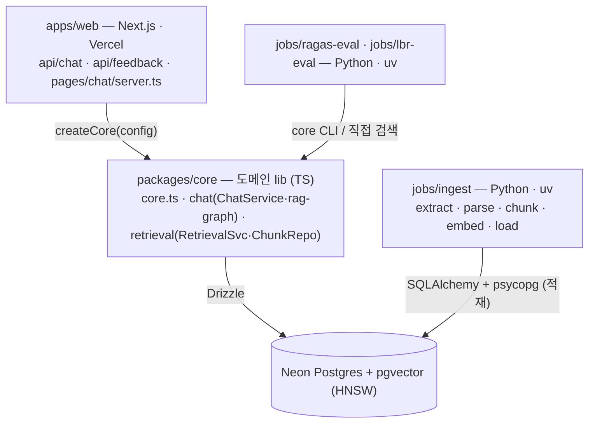

# Architecture

모듈 경계, 의존 방향, composition, 인프라. 데이터 모델은 [db-schema.md](./db-schema.md), API 계약은 [api.md](./api.md).

## 1. 모듈 구조



## 2. 의존 방향

- `apps/web → packages/core` **단방향**. core는 web 모름.
- `packages/core`는 `process.env` 직접 읽지 않음 — `createCore(config)` 인자로만 외부 의존 주입. env 로딩은 consumer 책임(Next.js 자동, CLI는 `tsx --env-file`).
- `jobs/ingest`와 `jobs/ragas-eval`은 process 경계로 완전 분리 — DB만 공유. web 번들에 Python 의존성 비유입 (Vercel은 `apps/web`만 빌드).

## 3. createCore — 부품을 한 곳에서 만들고 연결

DB·임베딩·재정렬·LLM·그래프를 `packages/core/src/core.ts::createCore(config)` 한 곳에서 만들어 잇는다. 외부 의존이 들어오는 단일 입구:

```ts
type CoreConfig = {
  databaseUrl: string;
  embeddingApiKey: string; // Voyage embed + rerank 공통
  embeddingModelId: string; // env VOYAGE_MODEL — ingest plane과 동일해야 cosine 의미
  generationApiKey: string; // OpenAI
};
// telemetry는 인자가 아니다 — core는 always-emit이고 SpanProcessor 부팅 여부로만 활성/no-op.
// 자세한 layering 원칙은 docs/observability.md 참고.

type Core = {
  chat: ChatService; // ask · recordChatTurn
  retrieval: RetrievalService; // retrieve (CLI 단독 호출 지점)
  embeddingModelId: string;
  close: () => Promise<void>;
};
```

`chat` 서비스 내부는 `RagGraph` + `MessageRepository`를 합성. 그래프 자체 조립은 composition root 책임(`createRagGraph({ generationModel, retrieve, voyageApiKey })`). evaluation은 별도 plane(`jobs/ragas-eval`)이 owns — core는 ask·retrieve library만 빌려준다.

## 4. 적재·검색 임베딩 모델 일치

법령을 넣을 때(적재)와 질문을 검색할 때 **같은 임베딩 모델·차원**(`voyage-4`, 1024)을 써야 유사도 비교가 의미를 가짐. 양쪽이 `VOYAGE_MODEL` env를 공유. 모델 변경 = 전체 재적재. 상세는 [embedding.md](./embedding.md).

## 5. Security

- 인증·RBAC·PII는 비범위(익명 접근).
- env는 `packages/core/src/env.ts::parseEnv`(zod)가 검증만, 로딩은 consumer 책임.
- rate limit은 [api.md §1](./api.md#1-client--server-network).

## 6. 인프라

```
dev                              prod
docker-compose.yml               Vercel (apps/web만 빌드)
  postgres + pgvector            Neon Postgres + pgvector
                                 Langfuse Cloud / self-host
ingest 실행: pnpm ingest:extract → parse → chunk → embed → load (로컬 수동)
```
