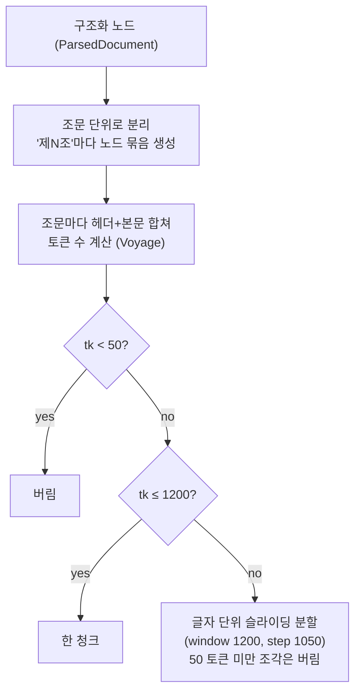

# Chunking

`ParsedDocument`의 노드 시퀀스를 "제N조" 단위로 끊어 한 조문을 한 청크로 만든다. 입력은 raw PDF가 아니라 파싱 단계가 만든 구조화 노드다. 구현: `jobs/ingest/src/ingest/chunking/chunker.py`.

## 1. 결정 요약

| 항목 | 값 | 근거 |
|---|---|---|
| boundary | 줄 첫머리의 "제N조"(제N조의M 포함)가 제목 괄호 또는 줄 끝으로 이어질 때만 조문 시작으로 인식 | 본문 중간의 인용("제5조제3항에 따른")을 새 조문으로 오인해 잘못 끊는 것을 막는다 |
| max_tokens | 1200 | chunking 명세 권장 상한(권장 300~900, 절대 1200) |
| overlap | 150 토큰 | 한 조가 1200 초과해 char 슬라이딩이 발동할 때만 적용 |
| min_tokens | 50 | 미만 chunk drop — "제N조 삭제" 같은 1줄 조 |
| 토크나이저 | Voyage 공식 `voyageai.Client.count_tokens(model=...)` | voyage 임베딩과 동일 토크나이저로 토큰 한도 정확성 확보 |
| 헤더 prepend | `{law} 제N조 ({chapter} > {section})\n\n{body}` | 법명·조항호 식별이 검색 정확도에 결정적 |
| 식별자 | `content_hash = sha256(content)[:16]` | 임베딩 캐시 키 + DB UNIQUE 제약. 재실행 안전 |

## 2. 알고리즘 (`chunk_parsed`)



- `_split_by_article`: boundary 이전 선행 노드(chapter heading 등)는 `article=None` 그룹으로 한 번만 yield.
- `head` = `"{law} 제{article_no}조 ({chapter} > {section})"`, `full` = `head\n\n{body}`.

- article은 state 추적 없이 텍스트의 "제N조"를 split key로 신뢰 — 부칙·본법 카운터 리셋으로 인한 `(chapter, article)` 키 충돌 회피.

## 3. 재실행해도 안전한 이유 (content_hash)

청크 내용을 해시한 `content_hash`(`sha256(content)[:16]`)를 청크의 지문으로 쓴다. 내용이 같으면 해시도 같으므로, 같은 문서를 다시 ingest해도 이미 처리한 청크를 알아보고 건너뛴다. 결과적으로 ingest를 몇 번 돌려도 임베딩 비용과 적재 결과가 그대로다.

- **임베딩**: 캐시에 같은 해시가 있으면 임베딩 API를 다시 부르지 않는다 → 비용 0.
- **DB 적재**: `chunks (doc_id, content_hash)`에 UNIQUE 제약 + `INSERT ... ON CONFLICT DO NOTHING` → 같은 청크는 중복 적재되지 않는다.

## 4. Chunk DTO (`jobs/ingest/src/ingest/chunking/dto.py`)

```python
class Chunk(BaseModel):
    id: str                            # "{law}#{ordinal:04d}"
    law: str
    effective_date: str | None
    chapter: str | None                # parser가 추적
    section: str | None                # parser가 추적
    article: str | None                # chunker가 boundary에서 추출 (예: "5", "5의2")
    content: str                       # head + body
    content_hash: str
    token_count: int
    refs: list[str]                    # parser가 추출한 "제○○조" cross-reference
    pages: list[int]
    source_node_ids: list[str]
```

load가 `chunks.metadata` jsonb로 직렬화(snake-case). 항·호 단위 필터링은 별도 필드 없이 chunk 텍스트의 `①②③`/`1. 2.` 마커로 LLM이 직접 처리.

## 5. CLI

```bash
pnpm ingest:chunk           # 전체 source
pnpm ingest:chunk -- --ids vat-law-2025  # 단건
```

입력 `.cache/parsed/{sid}.json` → 출력 `.cache/chunks/{sid}.json`.

## 6. 관련 단계

ingest 파이프라인은 parse → chunk → embed → load 순으로 흐른다. chunking은 그 중간 단계다.

- **입력**: parse 단계의 결과물. 장·절·참조(chapter/section/refs) 메타가 붙고 본문은 NFKC로 정규화된 구조화 노드.
- **출력**: 청크 본문 + `content_hash`. 이를 [embedding.md](./embedding.md)가 벡터로 변환하고, load 단계가 `chunks` 테이블에 적재한다.
- **적재 방식**: 평소엔 `content_hash`로 중복을 건너뛰며 쌓는다(§3). 임베딩 모델·차원을 바꿔 기존 벡터를 통째로 갈아야 할 때만 `load --reset`으로 테이블을 비우고 다시 적재한다.
