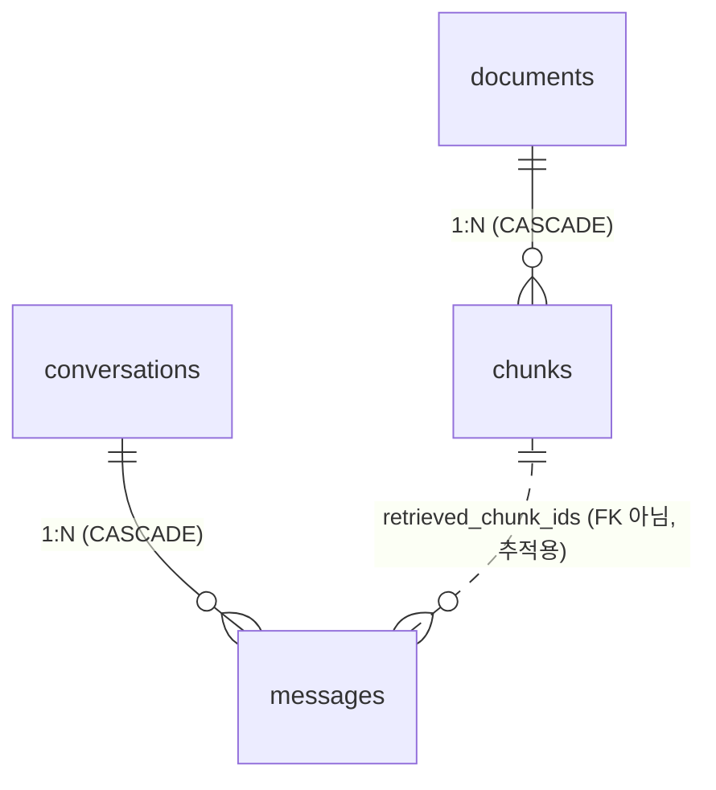

# DB Schema

PostgreSQL + pgvector. 스키마 기준은 Drizzle ORM(`packages/core/src/database/schema/{retrieval,chat}.ts`), 마이그레이션도 Drizzle(`pnpm db:migrate`). Python ingest는 같은 구조를 복제만 한다.

## 테이블 관계

두 묶음 — **법령**(검색 대상)과 **대화**(채팅 기록). 서로 FK 없이 분리, `chunks.id`만 `messages.retrieved_chunk_ids`로 느슨히 참조(추적용, FK 아님).

- `documents → chunks`: 법령 PDF 1건 → 조문 조각 N개. 문서 삭제 시 조각도 삭제.
- `conversations → messages`: 대화 1건 → turn N개. 대화 삭제 시 메시지도 삭제.
- `chunks → messages`: 답에 쓰인 조각 id를 `messages.retrieved_chunk_ids`(uuid[])에 기록 — FK 아닌 로그 join용.

## documents — 법령 PDF 1건

| 컬럼 | 타입 | 비고 |
|---|---|---|
| `id` | uuid PK | |
| `title` | text NOT NULL | 법령명 |
| `source_url` | text | 원문 출처 |
| `version` | text | 공포번호·시행일 |
| `file_hash` | text UNIQUE NOT NULL | 같은 PDF 재적재 차단 |
| `created_at` | timestamptz NOT NULL | |

## chunks — 조문 조각 1개 (검색·인용 단위)

documents에 종속(`doc_id` FK, CASCADE).

| 컬럼 | 타입 | 비고 |
|---|---|---|
| `id` | uuid PK | |
| `doc_id` | uuid FK→documents | 부모 삭제 시 함께 삭제 |
| `page` | int | |
| `section_path` | text | |
| `content` | text NOT NULL | 본문 — 인용 위치 기준 |
| `content_hash` | text NOT NULL | 임베딩 캐시 키 |
| `embedding` | vector(1024) NOT NULL | voyage-4 차원 |
| `metadata` | jsonb NOT NULL | 아래 키 셋 |
| `created_at` | timestamptz NOT NULL | |

- UNIQUE (`doc_id`, `content_hash`) — 같은 법령 내 중복 조각 차단
- 인덱스: `doc_id`, **HNSW**(`embedding`, cosine) 벡터 검색
- `metadata` 키: `chunk_id · law · effective_date · chapter · section · article · refs[] · pages[] · source_node_ids[] · token_count` (의미는 [chunking.md](./chunking.md))

## conversations — 대화 1건

`id` uuid PK · `title` text · `created_at` timestamptz NOT NULL.

## messages — 대화 turn 1건

conversations에 종속(`conversation_id` FK, CASCADE).

| 컬럼 | 타입 | 비고 |
|---|---|---|
| `id` | uuid PK | |
| `conversation_id` | uuid FK→conversations | |
| `role` | text NOT NULL | user / assistant |
| `content` | text NOT NULL | |
| `citations` | jsonb NOT NULL | 인용 객체 배열 |
| `retrieved_chunk_ids` | uuid[] | 답에 쓰인 chunks 추적 (FK 아님) |
| `model` · `latency_ms` · `input_tokens` · `output_tokens` | | 메타 |
| `trace_id` | text | 피드백 점수 연결 키 |
| `created_at` | timestamptz NOT NULL | |

- 인덱스: `conversation_id`
- turn 종료 시 conversations와 한 transaction으로 기록

## 주의

- **embedding 차원 1024 = voyage-4 고정**. 모델 교체 시 차원·인덱스 동시 변경 + `load --reset`로 옛 벡터 제거.

## pgvector 개념

PostgreSQL에 벡터 검색을 더해주는 확장. 별도 벡터 DB 없이 임베딩을 같은 DB에 두고 SQL로 검색한다.

- **`vector(n)` 타입**: n차원 실수 배열을 한 컬럼에 저장. 이 스키마는 `chunks.embedding vector(1024)`.
- **거리 연산자**: `<=>` 코사인, `<->` L2(유클리드), `<#>` 내적. 정렬·필터를 SQL `ORDER BY embedding <=> $query`로 쓴다. 이 프로젝트는 코사인 거리.
- **ANN 인덱스 (HNSW)**: 모든 행을 비교하는 정확 검색은 느려서, 근사 최근접 이웃(ANN) 인덱스로 빠르게 후보를 좁힌다. HNSW는 그래프 기반 ANN으로 조회가 빠른 대신 약간의 정확도를 내준다 — 코사인 거리로 `chunks.embedding`에 걸려 있다.
