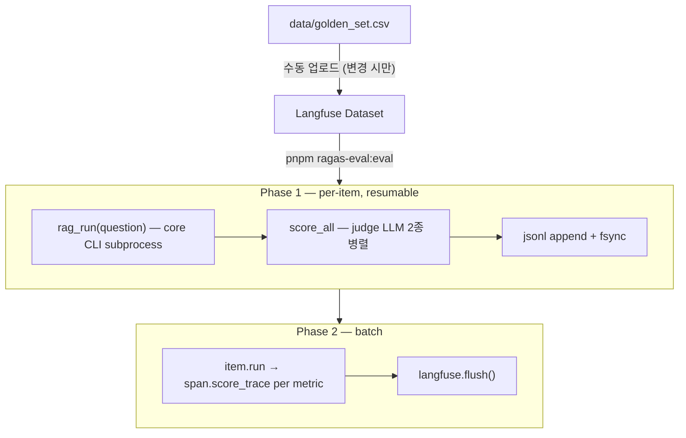

# Evaluation

평가 지표와 실행 절차. 평가셋(시험 문제) 설계는 [goldenset.md](./goldenset.md).

**2개 layer로 잰다** — ① **검색 품질**(lbr-eval), ② **답 품질**(RAGAS). 검색이 회수하지 못한 조문은 생성 단계에서 복구할 수 없어 검색 품질이 답 품질의 상한을 정한다. 그래서 검색 layer를 먼저 본다. 둘 다 `data/golden_set.csv`를 입력으로 쓴다.

## 1. 검색 품질 — lbr-eval

`jobs/lbr-eval`. LegalBench-RAG (Pipitone 2024) 기반. LLM 채점 없이, 정답 조문(`must_include_articles`) ID set과 실제 검색 결과를 비교한다. 실제 서비스 검색 흐름(다듬기→2갈래→합치기)을 그대로 잰다.

| 지표          | 정의                                 | 용도                                   |
| ------------- | ------------------------------------ | -------------------------------------- |
| **Recall@10** | 정답 조문 중 상위 10개가 회수한 비율 | **주요 지표** — 답 품질의 상한         |
| Precision@10  | 상위 10개 중 정답 조문 비율          | 보조 — config·모델 변경 시 상대 비교용 |

- **Recall@10이 주요 지표.** 누락 조문은 답으로 복구 불가하므로 회수율이 곧 답 품질의 천장이다.
- Precision@10은 절대값이 낮다 — `must_include`가 sparse label이라 정답 외 유효 조문도 분모에 섞인다(recall 우선 설계의 의도된 trade-off). 절대값보다 같은 평가셋에서 config·모델을 바꿨을 때의 상대 변화를 본다.

## 2. 답 품질 — RAGAS (2개)

`jobs/ragas-eval`. 검색이 회수한 근거 위에서 생성된 답을 LLM이 채점한다.

| 지표 | 측정 | 용도 | ground truth 참고 |
| --- | --- | --- | --- |
| `Faithfulness` | 답이 근거 조문에서 벗어나지 않는가 | 환각·근거 이탈 검출 | 불필요 (검색 근거만 대조) |
| `FactualCorrectness(f1)` | 답이 모범답안과 사실이 맞는가 | 답 정확도 | 필요 (모범답안과 대조) |

- 의미 유사도 기반 점수는 법령 톤에 불리해 쓰지 않고 사실 일치(F1)·근거 충실도만 본다. 임베딩 채점 의존 없음.
- 두 지표 `asyncio.gather` 동시 호출. 빈 응답이면 response-사용 지표는 judge 호출 없이 0점 skip.

## 3. 채점 LLM

- judge: `openai/gpt-5-nano` (LiteLLM + instructor JSON mode), `llm.py::DEFAULT_MODEL`. 1 사이클 ≈ 56원·2~6분.
- embedding 채점 없음 → RAGAS 2지표는 embedding judge 미사용.
- 채점 layer만 LiteLLM 허용, 챗봇 본체는 직접 호출.

## 4. 실행 흐름 (RAGAS, 2-phase)



- Phase 1 중단 시 jsonl까지가 진실, 재실행 시 done set skip.
- Phase 2 실패 시 Phase 1 skip + Phase 2만 재시도 (judge 비용 0).

run_name = `{dataset}-{timestamp}` (매 실행 별도 run). `LANGFUSE_RELEASE`는 git commit SHA로 cohort 라벨링.

## 5. 입출력

`.tmp/ragas-eval/results.jsonl` (Phase 1 산출, Phase 2 입력):

```jsonc
{
  "sample_id": "vat-base-easy-1",
  "user_input": "...",
  "retrieved_contexts": ["chunk content", ...],   // raw top-k (RAGAS 정확도용)
  "response": "...",
  "reference": "...",
  "scores": { "faithfulness": 1.0, "factual_correctness": 0.83, ... },
  "meta": { "category": "...", "latencyMs": 1820, ... }
}
```

## 6. CLI

```bash
pnpm ragas-eval:eval          # 답 품질 (Phase 1 + Phase 2)
pnpm lbr-eval:eval            # 검색 품질 (R@k · P@k)
```
