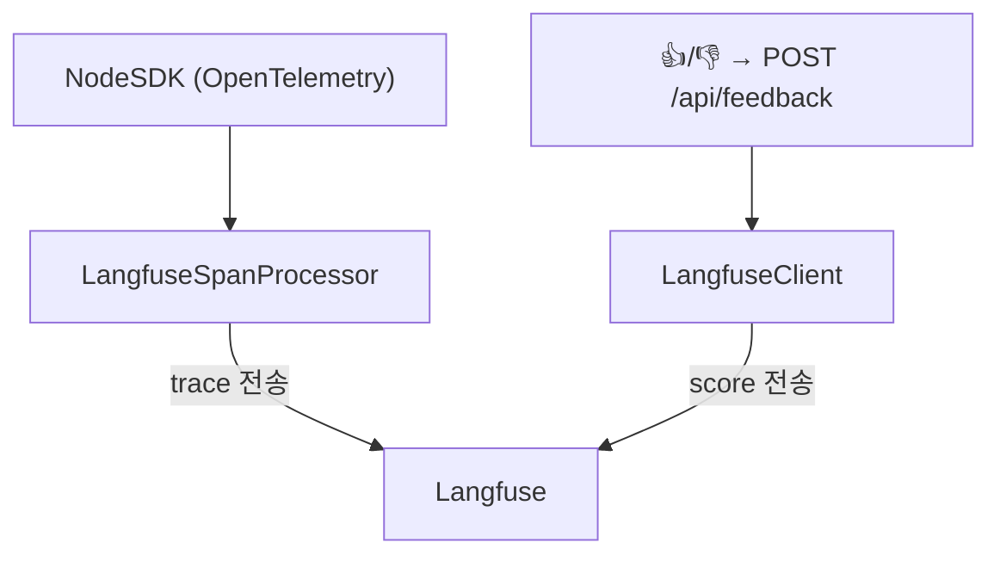
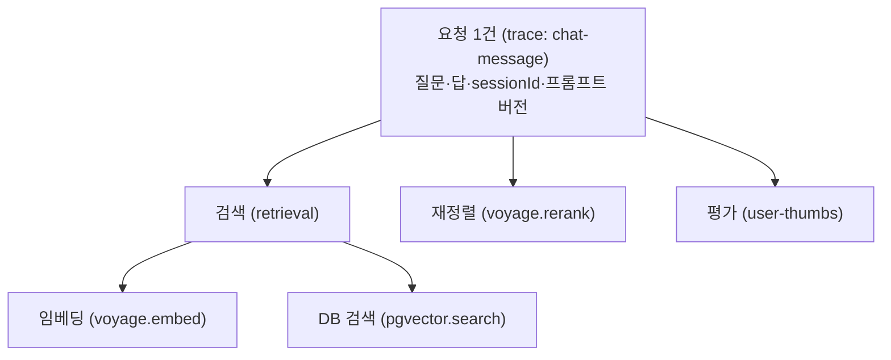

# Observability

요청이 어떻게 처리됐는지 **기록을 남기고**(검색·임베딩·LLM 호출 등), 사용자 평가(👍/👎)를 모은다. 둘 다 Langfuse로 보낸다.

이 프로젝트 기준으로:

- 사용자가 `/api/chat`에 질문 1건을 보내면 **trace** 1개가 생긴다 — 그 요청의 전체 처리 기록.
- 처리 중 거치는 각 작업(검색·임베딩·DB 벡터 검색·재정렬)마다 **span** 1개가 생긴다 — 그 작업이 언제 시작·끝났고 입력·출력이 뭐였는지.
- span은 trace 아래에 부모-자식으로 쌓인다: `trace(질문)` ▸ `검색` ▸ `{임베딩, DB 검색}`, 그리고 `재정렬`(§3 그림).
- 나중에 사용자가 👍/👎를 누르면 그 trace에 **score**가 붙는다.

요약: **trace = 질문 1건, span = 그 안의 작업 1개, score = 그 질문에 대한 평가.** `messages.trace_id`로 DB 대화 기록과 Langfuse trace를 잇는다.

## 1. 기록 켜기

- `apps/web/instrumentation.ts`(Next.js 컨벤션)가 서버 시작 시 OpenTelemetry를 켠다. `/api/chat`은 이 SDK가 필요해 Node 런타임에서 실행.
- 환경(`VERCEL_ENV`/`NODE_ENV`)별로 trace를 나눠 담아 dev/preview/prod가 한 대시보드에서 섞이지 않는다.
- `LANGFUSE_*` 키가 없으면 기록만 조용히 버리고 앱은 정상 동작(dev 마찰 0).
- Vercel은 응답이 끝나면 함수가 죽어 버퍼가 날아가므로, 응답 후 `forceFlush()`로 trace를 강제 전송.

## 2. 무엇을 기록하나

LangChain/LangGraph 자동 연동은 미사용 → 외부 호출에 가장 가까운 함수에서 **직접** 기록한다. 현재 기록되는 단계:

| 기록 지점 | 만드는 기록표(span) |
|---|---|
| `retrieval.service.ts` | 검색 1회 (`retrieval`) |
| `embedding.adapter.ts` | 임베딩 호출 (`voyage.embed`) |
| `chunk.repository.ts` | DB 벡터 검색 (`pgvector.search`) |
| `rerank.adapter.ts` | 재정렬 호출 (`voyage.rerank`) |
| `pages/chat/server.ts` | (span 아님) 요청 전체에 붙는 메타 — 질문·답·`sessionId`·프롬프트 버전 |

- 기록 함수(`traceEmbedding`·`traceRetriever`·`traceSpan`)는 `packages/core/src/common/telemetry.ts` 한 곳에만 모여 있다. SDK가 안 켜진 환경(CLI 등)에선 자동으로 아무 일도 안 한다.
- **아직 기록 안 되는 것**: LangGraph 노드 단계(`search_direct` 등)와 LLM 토큰 사용량 — `finish.inputTokens`/`outputTokens`는 항상 undefined.

## 3. 한 요청이 남기는 기록 구조

검색 span 안에 임베딩·DB검색이 자식으로 들어가고, 재정렬과 사용자 평가가 같은 요청에 붙는다. (Voyage 단가는 Langfuse 기본에 없어 대시보드 Models에서 1회 등록해야 비용이 집계됨.)

## 4. 사용자 평가 (Feedback)

`features/submit-feedback/server.ts::recordFeedback` — `POST /api/feedback`의 `{ traceId, value: 1|-1 }`를 받아 Langfuse에 점수로 붙인다(`name: "user-thumbs"`, `dataType: "NUMERIC"` — `-1` 보존). 요청 형식은 [api.md §1](./api.md#1-client--server-network).

- 화면의 `FeedbackBar`는 trace_id를 못 받은 경우(기록 미작동) 안 보인다.
- 점수는 Langfuse에만 저장(DB 미저장), 코멘트 등 상세 feedback은 안 받는다.

## 5. 환경 변수

| 변수 | 미설정 시 |
|---|---|
| `LANGFUSE_PUBLIC_KEY` · `LANGFUSE_SECRET_KEY` | 기록·전송만 건너뜀 |
| `LANGFUSE_BASEURL` | 기본값 (dev=docker-compose, prod=Langfuse Cloud) |

## 6. 핵심 메트릭

응답 지연 P50/P95 · 검색 최고 유사도 분포 · 사용자 만족도(👍/👎).
