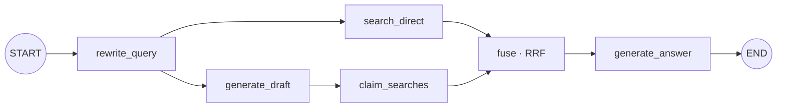
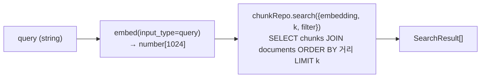

# RAG Chain

런타임 RAG 체인 전체 — 질문 + history → follow-up rewrite → 두 갈래 병렬 검색(direct + draft+claims) → RRF fuse → answer. 위치: `packages/core/src/modules/chat/` + 검색 primitive `packages/core/src/modules/retrieval/`. v16 6-노드 parallel(rewrite_query + 5).

## 1. 흐름

`chat.service.ts::ask(query, opts)` → (conversationId 있으면 `recentTurns(id,6)`로 history 병합) → `rag-graph.invoke({messages})` → `{ answer, citations[] }` → stream wrapper로 1회 emit(`textStream` 1 chunk · `citationStream` N burst · `chunks` · `finish`).

LangGraph (`rag-graph/`) v16 parallel DAG:



반환 타입은 [api.md §2](./api.md#2-server--core-in-process).

## 2. 검색 primitive (RetrievalService)

`packages/core/src/modules/retrieval/`. **단발 dense vector 검색** — embed + pgvector top-k. rerank·multi-query 분기는 본 service 밖(그래프 노드)에서 합성. evaluation plane이 직접 호출할 수 있는 검색 primitive.



SQL 핵심 (`chunk.repository.ts::search`):

```sql
SELECT chunks.*, documents.title, documents.version, documents.source_url,
       1 - (chunks.embedding <=> $query_emb) AS similarity
FROM chunks INNER JOIN documents ON documents.id = chunks.doc_id
WHERE ($tax_type::text IS NULL OR chunks.metadata->>'tax_type' = $tax_type)
ORDER BY chunks.embedding <=> $query_emb
LIMIT $k;
```

- `<=>` pgvector cosine distance, `1 - distance` = similarity.
- `INNER JOIN documents`로 인용 모달용 `docTitle`/`docVersion`/`sourceUrl` 동시 반환.
- 인덱스 `idx_chunks_embedding` HNSW(`vector_cosine_ops`, m=16/ef_construction=64 기본). 토이 규모엔 ivfflat 튜닝보다 HNSW 기본이 무난.
- `tax_type` 필터는 legacy — 현 법령 소스 metadata엔 없어 no-op.
- 두 단계 모두 telemetry HOF로 wrap ([observability.md](./observability.md)).

`SearchResult` (도메인 표면 camelCase, SQL alias 직접 매핑):
```ts
type SearchResult = {
  chunkId; docId; sourceId;            // sourceId: legacy, 법령 소스에선 빈 값
  docTitle; docVersion; sourceUrl; page; sectionPath;
  content;                             // chunk 본문 — citation 객체화 시 그대로 박제
  similarity;                          // 1 - cosine_distance
  metadata;                            // chunks.metadata jsonb (db-schema.md)
};
```

`RetrievalService.retrieve(query, opts?)` — `opts.k` 기본 8, `opts.filter.taxType`(legacy, 효과 없음). similarity threshold 없음(top-k + rerank + RRF fuse가 뒤에서 절단). 호출자: 그래프 노드(`searchWithRerank`로 prefilter=50 후 slice), `jobs/ragas-eval`, `jobs/lbr-eval`.

## 3. LangGraph 노드

`rag-graph/` (`index.ts` wiring + `nodes/retrieval.ts`·`nodes/answer.ts` + `shared.ts` State). retrieval 5-노드는 `retrievalSubgraph`로 compile, full graph가 단일 node로 wrap — lbr-eval은 subgraph 직접 invoke(sync drift 차단).

| 노드 | 책임 | LLM call | 출력 채널 |
|---|---|---|---|
| `rewrite_query`   | history + last user message → standalone query. 단일 턴(history 0)이면 LLM bypass | 0~1 | `rewrittenQuery` |
| `search_direct`   | rewritten query 1회 retrieve+rerank → top-8 (`DIRECT_K=8`) | 0 (embed 1, rerank 1) | `directChunks` |
| `generate_draft`  | `withStructuredOutput({draft, claims[≤6]})` — 자체지식 답 초안 + atomic claim. 사용자 미노출 | 1 | `draft`, `claims` |
| `claim_searches`  | claim별 retrieve+rerank 병렬 → 각 top-4 (`CLAIM_K=4`) | 0 (embed N, rerank N · `Promise.all`) | `claimChunks` |
| `fuse`            | RRF(`RRF_K=60`)로 directChunks + claimChunks 결합 → top-10 (`FUSE_TOP_N=10`) | 0 | `toolChunks` |
| `generate_answer` | `createReactAgent` + `responseFormat`. draft + claim_evidence + chunks 입력, chunk만 ground truth | 1 + tool steps | `answer`, `citations` (verify 통과) |

엣지: `START → rewrite_query → {search_direct, generate_draft}`, `generate_draft → claim_searches`, `{search_direct, claim_searches} → fuse → END`(subgraph). full graph: `START → retrieve(subgraph) → generate_answer → END`. 분기·재시도 없는 결정론적 DAG(품질 게이트는 offline 평가로 위임). `recursionLimit: 10`.

`searchWithRerank` 헬퍼(`nodes/retrieval.ts`)가 `retrieve(prefilter=50)` + `VoyageRerankCompressor.compressDocuments` + `slice(0, k)`를 합성. 검색 키는 `rewrite_query`가 만든 `rewrittenQuery`.

## 4. 모델 결정

`generation.adapter.ts`:
- `GENERATION_MODEL_ID = "gpt-5-mini"`
- Provider: `@langchain/openai`의 `ChatOpenAI` 직접 import (universal factory 비채택 — Turbopack이 변수 dynamic import를 정적 해결 못해 web bundle에서 500. provider 1개라 universal 무의미)
- `reasoning.effort = "low"` + `verbosity = "low"` — 검색을 결정론적 그래프로 옮겨 LLM 호출당 무거운 reasoning 불필요. draft·answer 둘 다 low

같은 `BaseChatModel` 인터페이스를 draft·answer 노드가 소비. provider 교체 시 본 파일만 수정.

## 5. Structured output — citation 1회 emit

`generate_answer` 노드가 `createReactAgent({ llm, tools, responseFormat: AnswerSchema })`로 한 번에 받는다:

```ts
const AnswerSchema = z.object({
  answer: z.string(),
  citations: z.array(z.object({
    chunkId: z.string(),
    quote: z.string(),       // 길이 제약은 prompt에서만 안내
  })),
});
```

수신 후 verify 루프:
1. `resolveChunk(chunkId, registry)` — fuse 통과 10개 중 strict 매칭 → 실패 시 UUID 8-prefix fallback → 둘 다 실패 시 drop
2. `findQuote(chunk.content, quote)` — 6-tier substring 매칭 (strict → outer 마커 제거 → ws 정규화 → 줄임표 segment → ws 완전 제거 → prefix-suffix span)
3. 매칭 통과 시 `toCitation(chunk, match)`로 `quoteStart`/`quoteEnd` 좌표 박제. 6-tier 다 실패 시 `toCitationUnmatched`로 highlight 없이 노출

→ 환각 인용이 영속 저장소(`messages.citations`)에 새지 않음. UI는 char index로 highlight.

answer agent에 노출되는 calc 도구는 `date_after`/`vat_calc`. chunk 검색 도구는 없음 (검색은 결정론적 그래프 노드가 owns).

## 6. Multi-turn

```ts
const history = opts.conversationId
  ? await messageRepo.recentTurns(opts.conversationId, 6)  // HISTORY_WINDOW
  : [];
graph.invoke({ messages: [...history, new HumanMessage(query)] }, { recursionLimit: 10 });
```

- `HISTORY_WINDOW = 6` 메시지 = user+assistant 짝 3 round-trip. DB에선 최신순 LIMIT으로 끝만 잘라와 시간순으로 펼침.
- 이전 turn의 citation 메타는 history에 미포함 — 텍스트 답변만 컨텍스트로.
- `rewrite_query`가 history + last user message → standalone query 합성 → `search_direct`·`claim_searches`가 `rewrittenQuery`를 검색 키로 사용. history 0이면 LLM bypass. `generate_answer`는 messages 배열을 그대로 받아 분해를 LLM이 직접 처리.

## 7. Prompt

`prompt.ts`. `PROMPT_VERSION = "v4.5"` — 평가 cohort 비교 키. 세 system prompt:
- `REWRITE_QUERY_SYSTEM` — `rewrite_query`. follow-up → standalone query + 일상어→법령어 정규화. 동사 치환 금지·위임 trigger 보존
- `DRAFT_WITH_CLAIMS_SYSTEM` — `generate_draft`. 자체지식 draft + atomic claim 배열. 출력은 검색 키 전용. 수치·임계는 일반 표현 우선(stale 안전장치)
- `ANSWER_SYSTEM` — `generate_answer`. chunk-grounded synthesis with draft as guide. claim별 evidence verify → 뒷받침되면 채택, 안 되면 reject. verified 사실(기본·예외·위임 시행령·사후 수정·폐업 특례)을 별도 문장으로 답에 포함 (Verify-and-Edit / ALCE 패턴)

`nodes/answer.ts`의 `<draft>` / `<claim_evidence>` / `<chunks>` / `<question>` XML 블록은 prompt가 아닌 노드가 직렬화.

## 8. SSE 스트리밍 (web)

`apps/web/src/pages/chat/server.ts::streamChat`이 `core.chat.ask` 결과를 AI SDK `createUIMessageStream`으로 직렬화. parts 형태는 [api.md §1](./api.md#1-client--server-network).

text·citation 두 channel을 `Promise.all`로 병렬 drain. 본문 token streaming은 없어 `text-delta`는 1회 burst, `data-citation`은 N건 burst. ChatWindow UI는 graph 완료까지 typing indicator. 종료 후 `recordChatTurn`으로 conversations + messages 2건 transaction 기록.

## 9. 에러 처리 (시스템 경계만)

| 케이스 | 처리 |
|---|---|
| 모델 호출 실패 | throw → 응답 5xx (retry 없음) |
| context 비어있음 | fuse 결과 0건이어도 `generate_answer` 호출됨. ANSWER_SYSTEM fallback으로 "공식 자료에서 확인되지 않습니다" emit |
| structured output schema 위반 | LangChain이 throw — 상위로 propagate |
| citation verify 실패 | 6-tier fallback. 다 실패 시 highlight 없이 노출 또는 chunkId 미일치면 drop |
| persist 실패 | 답변은 이미 전달 — 서버 로그만 |

내부 함수(repository, retrieve)는 방어 코드 없음.
